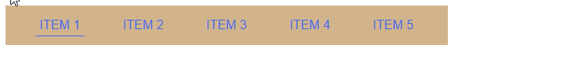

# Navigation menu with a bar under the active menu item

---

This is a project in the usage of:
1. The pseudoelements of ::before and ::after
2. The position property

The way it functions is by detaching the ::after pseudoelement for
the active menu entry from the page flow and treating it as an empty
container for the underbar.

